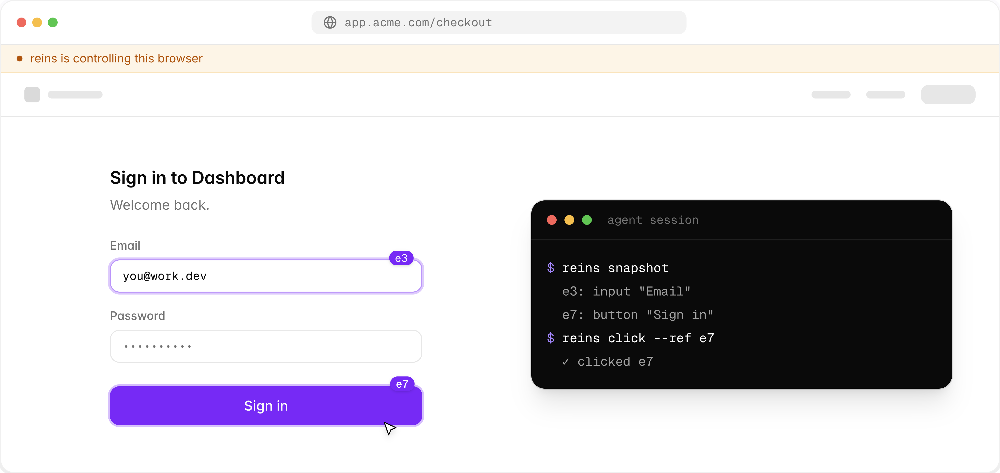

<p align="center">
  
</p>

<h1 align="center">reins</h1>

<p align="center"><strong>Take the reins of your real browser from any coding agent.</strong></p>

<p align="center">
  <a href="https://reins.tech">reins.tech</a> ·
  <a href="https://reins.tech/docs">docs</a> ·
  <a href="https://reins.tech/changelog">changelog</a>
</p>

<p align="center">
  <a href="https://www.npmjs.com/package/@karnstack/reins"></a>
  <a href="https://github.com/karnstack/reins/actions/workflows/ci.yml"></a>
  <a href="LICENSE"></a>
  <a href="https://chromewebstore.google.com/detail/reins/hnjcfgochepemjndccfblpmfmlblkofo"></a>
</p>

<p align="center">
  <picture>
    <source media="(prefers-color-scheme: dark)" srcset=".github/assets/browser-dark.png">
    
  </picture>
</p>

reins gives your coding agent (Claude Code, Cursor, Codex, Copilot — anything
with a shell) control of the real, logged-in Chromium browser you already use,
through a CLI and a Manifest V3 extension. No MCP server to register, no debug
profile, no launch flags, no tokens.

## Quick start

```bash
npm i -g @karnstack/reins        # the CLI (daemon included, starts on demand)
npx skills add karnstack/reins   # the skill, into your agent(s) of choice
```

Then install the extension in every Chromium browser you want agents to reach —
Chrome, Brave, Edge, Arc, Dia:

**[Add reins from the Chrome Web Store](https://chromewebstore.google.com/detail/reins/hnjcfgochepemjndccfblpmfmlblkofo)** — it finds the local daemon and connects on its own.

No store access? `reins extension` installs it via Load unpacked instead — see
[docs/SIDELOAD.md](docs/SIDELOAD.md). That's the whole setup; `reins status`
shows what's connected.

## The loop

```bash
reins snapshot              # list interactive elements with refs → e5: button "Submit"
reins click --ref e5        # act by ref
reins text                  # verify (or: reins screenshot → prints an image path)
```

Every command takes `--tab <id>` (default: active tab), `--browser <id>` (only
when several are connected), and `--json`. `reins help` is self-describing;
`reins cdp` is the escape hatch to the full Chrome DevTools Protocol.

## Learn more

The full story lives on the site:

- **[Docs](https://reins.tech/docs)** — getting started, architecture, and the complete command reference
- **[How it compares](https://reins.tech/docs/comparison)** — vs agent-browser, dev3000, and playwright-mcp
- **[Security](https://reins.tech/docs/security)** — per-site permissions, `127.0.0.1`-only binding, and the threat model
- **[Site permissions](https://reins.tech/docs/permissions)** — the `deny` / `read` / `full` tiers and how to tighten them

Report vulnerabilities privately via [GitHub security advisories](https://github.com/karnstack/reins/security/advisories/new).

## Develop

```bash
mise install        # Node 24.18.0 + pnpm 11.9.0 (exact, via mise)
pnpm install
pnpm dev            # watch-build all packages (extension → dist/)
pnpm test           # protocol + cli + extension unit/integration tests
pnpm lint && pnpm typecheck && pnpm build
pnpm reins tabs     # build + run any CLI command
```

Local walkthrough (load unpacked, allow the dev ID, drive tabs):
**[docs/RUNNING.md](docs/RUNNING.md)**. Releasing: **[docs/RELEASING.md](docs/RELEASING.md)**.

Packages: `protocol` (shared zod frames), `cli` ([`@karnstack/reins`](https://www.npmjs.com/package/@karnstack/reins), bin `reins`), `extension` (MV3), `web` ([reins.tech](https://reins.tech)), and `skills/reins` (the agent skill).

## License

[MIT](LICENSE)
